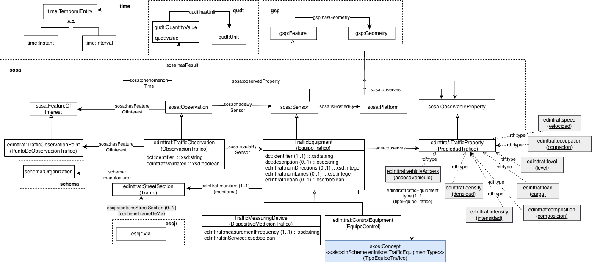
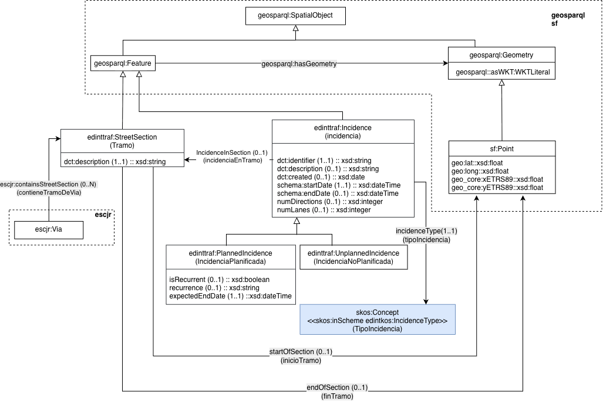

# Ontología para la representación del tráfico de vehículos en las ciudades (Vehicle traffic ontology)

La ontología de Tráfico representa los datos de medición del tráfico de vehículos de una ciudad así como las incidencias planificadas y no planificadas que pueden ocurrir. Incluye también las observaciones de control de velocidad y acceso de vehículos específicos.

# Propósito y alcance de la ontología (Purpose and scope of the ontology)

El propósito de esta ontología es el de proporcionar un vocabulario común para la representación de datos principales de las mediciones de tráfico en las ciudades tales como la intensidad, densidad, ocupación etc., así como mediciones de control que se hacen sobre vehículos específicos tales como la velocidad y el control de acceso. Además se representan los datos de las incidencias de tráfico planificadas y no planificadas y su geolocalización.

# Prefijo y espacio de nombres de la ontología (Prefix and namespace of the ontology)

El prefijo de la ontología es: edinttraf y se encuentra publicada en el espacio de nombres: [http://vocab.linkeddata.es/datosabiertos/def/transporte/trafico#]([(Prefix and namespace of the ontology](http://vocab.linkeddata.es/datosabiertos/def/transporte/trafico#)

# Modelo conceptual de la ontología (Ontology conceptual model)

# Estructura del repositorio (Repository structure)

El repositorio contiene las siguientes carpetas

| Carpeta | Descripción |
|--------|--------------|
| **diagrams/** | Contiene diagramas y otros recursos que representan el modelo conceptual de la ontología (por ejemplo, jerarquías de clases, relaciones). |
| **documentation/** | Contiene la documentación de la ontología y artefactos relacionados en formato HTML o dirigida a usuarios. |
| **kos/** | Contiene la implementación de vocabularios controlados o KOS, generalmente implementaciones SKOS en RDF.|
| **ontology/** | Contiene los archivos de implementación de la ontología en formatos como .owl, .rdf, .ttl o .jsonld |
| **requirements/** | Contiene todos los documentos utilizados para definir los requisitos de la ontología: ejemplos de datos, preguntas de competencia, requisitos funcionales, casos de uso, etc. |
| **shapes/** | Contiene las restricciones SHACL utilizad para validar datos respecto a la ontología.  |

# Mantenimiento del proyecto (Project maintenance)

Para manejar las incidencias o mejoras sugeridas con respecto a la ontología, recomendamos seguir las guías proporcionadas en ([Issues Management](./ISSUES.md)) para generar una incidencia.

# Financiación (Funding)

Esta ontología ha sido desarrollada en el contexto del Espacio de Datos para las Infraestructuras Urbanas Inteligentes ([EDINT](https://edint.es/)). 

